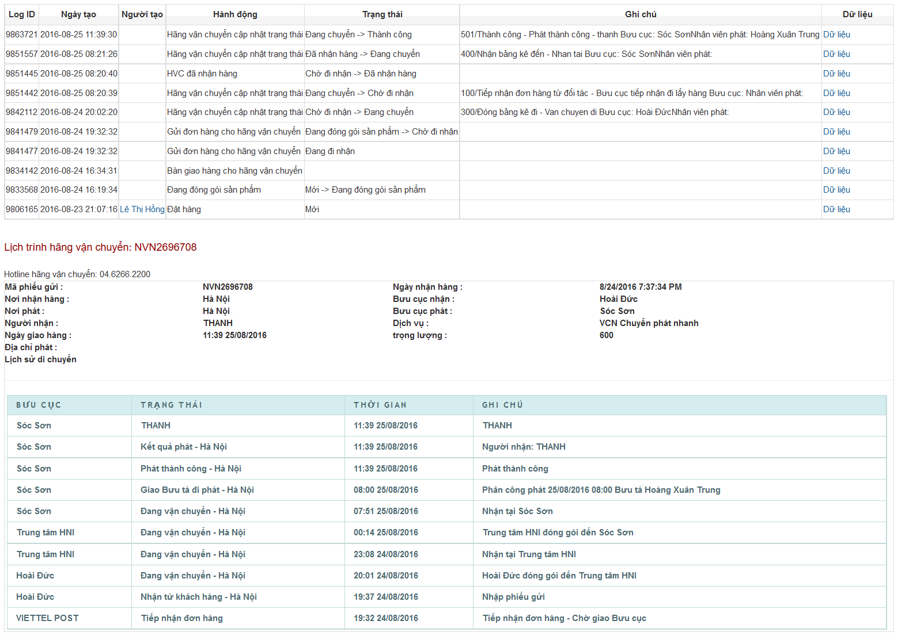

# /api/shipping/trackingframe
- Tính năng này dùng để tạo link url hiển thị lịch trình của đơn hàng
```php
<iframe src="https://graph.nhanh.vn/api/shipping/trackingframe?apiUsername=&storeId=&orderId=&checksum=" width="800" height="600"></iframe>
```
[ Xem hình Demo bên dưới ]

     
Trong đó:
**merchantId**: merchant id (deprecated)
**apiUsername**: apiUsername
**storeId**: id của gian hàng
**orderId**: id của đơn hàng
**checksum**:

```php
$data = $merchantId . $privateStoreId . $privateId; // @deprecated
// or
$data = $apiUsername . $privateStoreId . $privateId;
checksum = md5(md5(SECRET_KEY . $data) . $data);
```